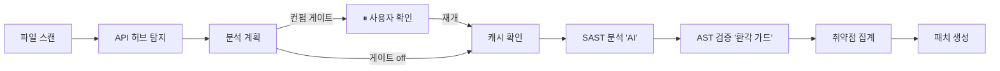

# SecureAI Engine — 설계·문서 쇼케이스

> **AI 기반 보안 분석 플랫폼** — 코드의 보안 취약점을 AI가 찾고, 실제로 위험한지 검증하고, 고치는 방법까지 제안하는 올인원 보안 엔진.

> ⚠️ **원본 프로젝트는 비공개(private)입니다.** 이 저장소는 **설계·아키텍처·문서 흐름만** 공개하는 쇼케이스로, **소스 코드는 포함되어 있지 않습니다.** 문서 속 코드 파일 이름(예: `sast_node.py`)은 구조 설명용 표기입니다.
>
> 🎬 시연 영상: *준비 중*

---

## 문제

- 소프트웨어 보안 취약점은 매년 늘어나지만, 기존 보안 검사 도구는 **"가짜 경고(오탐)"가 너무 많아** 개발자가 일일이 확인하다 지치고, 결국 신뢰하지 않게 됩니다.
- 최근 AI(LLM)로 코드를 분석하는 도구가 등장했지만, **AI가 실제로는 없는 취약점을 지어내는 '환각(hallucination)'** 문제로 "그 결과를 믿어도 되나?"라는 의심이 큽니다.
- 보안 전문 인력은 비싸고 부족합니다. 특히 작은 팀·스타트업은 **제대로 된 보안 검증을 받기 어렵습니다.**

## 해결

**SecureAI Engine**은 보안 검증의 전 과정을 AI로 자동화합니다.

1. **찾기 (SAST)** — AI 에이전트가 소스 코드를 단계별로 분석해 취약점을 탐지
2. **증명하기 (DAST)** — 찾은 취약점을 격리된 환경에서 실제로 공격해 "정말 위험한지" 검증
3. **고치기 (Patch)** — 취약점별로 안전한 수정 코드를 AI가 자동 제안
4. **연결하기 (DevSecOps)** — GitHub PR이 올라오면 자동으로 검사해 코멘트로 결과 게시, 위험하면 병합 차단
5. **증빙하기 (Report)** — 결과를 PDF·컴플라이언스(ISO27001/NIST/ISMS-P) 문서로 자동 생성

웹 에디터, 모바일 앱, 실시간 진행 상황 표시까지 하나의 제품으로 통합되어 있습니다.

## 차별점

- 🛡️ **"환각 방어" — 검증된 AI**: AI가 신고한 취약점을 코드 구조(AST)로 **다시 검증**해, 실제로 존재하지 않는 취약점은 **자동으로 폐기**합니다. "AI가 찾았다"가 아니라 **"검증을 통과한 것만 보여준다"**가 핵심입니다.
- 📊 **숫자로 증명하는 신뢰성**: 추상적인 "잘 찾습니다"가 아니라, **공개 표준 데이터셋(OWASP Benchmark)으로 자체 성능을 측정**하고 그 점수를 **CI에서 지속 추적**합니다. (대부분의 AI 보안 도구가 하지 않는 부분)
- ⏸️ **사람이 통제하는 자동화**: AI가 멋대로 전부 실행하는 게 아니라, **분석 계획을 사용자가 먼저 확인·조정**한 뒤 진행합니다.
- 💸 **비용 통제**: 분석 작업에 따라 Anthropic·Gemini·OpenAI 중 적합한 AI를 자동 선택해 원가를 관리합니다.

## 검증 & 진행 상황

기능을 "만들었다"에서 그치지 않고, **재현 가능한 방식으로 성능을 측정하는 체계**를 갖춘 것이 이 프로젝트의 핵심 가치입니다.

| 항목 | 내용 | 현재 |
|---|---|---|
| **구현 완성도** | 인증·SAST·DAST·패치·리포트 등 21개 기능 동작 | ✅ 완료 |
| **표준 벤치마크** | OWASP BenchmarkJava 961개 케이스로 자체 측정 | 탐지율(recall) **약 44%** · 오탐률(FPR) **약 27%** — *지속 개선 중* |
| **환각 방어** | 저장된 취약점은 모두 실제 코드 라인에 존재 | **가짜 인용 0건** |
| **회귀 추적** | 성능이 떨어지면 CI가 자동 경고 | ✅ 게이트 구축 |

> 현재 탐지율은 개선 중인 단계지만, 중요한 것은 **"표준 데이터셋 · 결정론적 검증 · CI 추적"이라는 측정 인프라를 먼저 갖췄다는 점**입니다. 측정할 수 있어야 개선할 수 있습니다.

---

## 한눈에 보기 (분석 흐름)

## 기술 스택

| 영역 | 스택 | 포트 |
|---|---|---|
| Backend | **Spring Boot 4** (Java 21, Virtual Threads) | 8080 |
| AI Engine | **Python 3.12**, FastAPI + **LangGraph** + Claude/Gemini/OpenAI | 8000 |
| MCP Server | **Node.js**, MCP (파일시스템·GitHub·Docker 도구) | 3100 |
| Frontend | **Next.js 15**, React 18, Zustand, Monaco Editor | 3000 |
| Mobile | **Kotlin** + Jetpack Compose, Room DB | — |
| Infra | PostgreSQL, Redis(Pub/Sub·캐시), Docker Compose, Nginx | — |

## 핵심 기능 (전체 21개 → [FEATURES.md](docs/FEATURES.md))

- 🔍 **AI SAST 파이프라인** — LangGraph 에이전트 단계별 취약점 탐지, 멀티 AI **BYOK**
- 🛡️ **결정론적 검증 레이어** — AST로 환각(가짜 취약점) 자동 폐기 (재현 가능)
- ⏸️ **계획 컨펌 게이트** — 사용자가 분석 계획 확인·조정 후 재개
- 💥 **DAST 동적 검증** — 격리 샌드박스에서 실제 익스플로잇
- 🤖 **GitHub PR 자동 리뷰** — Webhook + App, 변경 파일 검사 + 머지 차단
- 🔑 **시크릿 스캔 / SBOM+CVE / AI 패치 생성**
- 📋 **컴플라이언스 매핑 & 보안 보고서** (ISO27001/NIST/ISMS-P)
- ⚡ **실시간 SSE 스트리밍 · Monaco 통합 에디터 · Android 앱**

## AI 에이전트 기반 개발 방식

이 프로젝트는 **개발 과정 자체에도 AI 에이전트를 적극 활용**했습니다.

- **Claude Code 멀티 에이전트** (`.claude/`): 역할별 에이전트를 분리해 운영 — **PM**(스프린트 계획)·**Dev**(구현)·**Tester**(테스트 실행)·**Reviewer**(설계·보안 품질 게이트)·**Logger**(세션 기록). `/sprint` → `/stage` → `/done` 워크플로 스킬과 코딩·보안·Git 규칙을 정의해, **계획 → 병렬 구현 → 테스트 → 리뷰 → 커밋**을 스프린트 단위로 반자동화했습니다.
- **Gemini (Antigravity IDE) 브라우저 에이전트**: 자동화하기 어려운 **수동 UI 검증**(실제 브라우저로 화면 흐름 확인)과 **점진적 UI 개선**에 활용했습니다.

즉 코드 생성에 그치지 않고 **기획·테스트·코드리뷰·UI 검증까지 멀티 에이전트로 운영하는 개발 프로세스**를 실제로 적용했습니다.

## 📚 문서 (설계 흐름)

| 문서 | 내용 |
|---|---|
| [FEATURES.md](docs/FEATURES.md) | 구현된 21개 기능 카탈로그 (동작 설명 + 다이어그램) |
| [ARCHITECTURE_PHILOSOPHY.md](docs/ARCHITECTURE_PHILOSOPHY.md) | 아키텍처 철학 — 왜 이렇게 나눴는가 |
| [ARCHITECTURE_DECISIONS.md](docs/ARCHITECTURE_DECISIONS.md) | ADR — 주요 기술 의사결정 기록 |
| [PRINCIPLES.md](docs/PRINCIPLES.md) | 엔지니어링 원칙 (설계·보안·테스트) |
| [SAST_ENGINE.md](docs/SAST_ENGINE.md) | SAST 엔진 딥다이브 (LangGraph 노드 흐름) |
| [EVALUATION.md](docs/EVALUATION.md) | 평가·벤치마크 방법론 |
| [SECURITY_CHECKLIST.md](docs/SECURITY_CHECKLIST.md) | API 보안 체크리스트 |

---

본 저장소는 비공개 프로덕션 코드베이스의 설계 문서 일부를 발췌·정제한 것입니다. 코드 파일 참조는 구조 이해를 돕기 위한 표기이며 실제 소스는 포함되지 않습니다.
