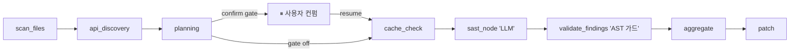

# SecureAI Engine — 설계·문서 쇼케이스

> **AI 기반 보안 분석 플랫폼** — SAST(정적) · DAST(동적) · AI 패치 추천을 하나의 파이프라인으로 통합한 풀스택 보안 엔진.

---

## ⚠️ 이 저장소에 대하여 (Read me first)

- **원본 프로젝트는 비공개(private)** 저장소입니다. 이 repo는 **설계·아키텍처·문서 흐름만** 공개하는 포트폴리오 쇼케이스입니다 — **소스 코드는 포함되어 있지 않습니다.**
- 문서 안의 코드 파일 참조(예: `AuthController.java`, `sast_node.py`)는 **구조 설명용 표기**이며, 실제 코드 링크는 비공개라 연결되지 않습니다.
- 즉, 여기서 볼 수 있는 것은 **"무엇을, 왜, 어떻게 설계했는가"의 흐름**입니다 — 기능 카탈로그, 아키텍처 의사결정, 엔지니어링 원칙, 검증 방법론.

## 🎬 시연 영상

▶️ **[시연 영상 보기 (Google Drive)](DEMO_VIDEO_LINK_HERE)**
<!-- TODO: Google Drive 공유 링크("링크 있는 사람 보기")로 교체 -->

---

## 한눈에 보기

분석 시작 → API 허브 탐지 → **계획 단계(사용자 컨펌 게이트)** → 파일 단위 SAST(LLM) → **결정론적 AST 검증(할루시네이션 가드)** → 취약점 저장 → AI 패치 생성. 진행 상황은 SSE로 실시간 스트리밍됩니다.

## 기술 스택

| 서비스 | 스택 | 포트 |
|---|---|---|
| Backend | **Spring Boot 4** (Java 21, Virtual Threads) | 8080 |
| AI Engine | **Python 3.12**, FastAPI + **LangGraph** + Claude/Gemini/OpenAI | 8000 |
| MCP Server | **Node.js**, MCP (filesystem/GitHub/Docker 도구) | 3100 |
| Frontend | **Next.js 15**, React 18, Zustand, Monaco Editor | 3000 |
| Mobile | **Kotlin** + Jetpack Compose, Room DB | — |
| Infra | PostgreSQL, Redis(Pub/Sub·캐시), Docker Compose, Nginx | — |

## 핵심 기능 (전체 21개 → [FEATURES.md](docs/FEATURES.md))

- 🔍 **AI SAST 파이프라인** — LangGraph 에이전트가 단계별로 취약점 탐지, 멀티 프로바이더 **BYOK**(Anthropic/Gemini/OpenAI)
- 🛡️ **결정론적 검증 레이어** — 모델이 신고한 `file:line`을 AST로 실재 검증해 **할루시네이션(가짜 인용) 자동 폐기** (LLM 미사용·재현 가능)
- ⏸️ **계획 컨펌 게이트** — 분석 계획을 사용자가 확인·제외 후 재개 (LangGraph `interrupt`/`resume`)
- 💥 **DAST 동적 검증** — SAST 발견 취약점을 **격리 샌드박스**(`dast-isolated-net`)에서 실제 익스플로잇
- 🤖 **GitHub PR 자동 리뷰** — Webhook + GitHub App, 변경 파일 SAST 후 PR 코멘트 + Critical 머지 차단
- 🔑 **시크릿 스캔 / SBOM+CVE / AI 패치 생성** — 커밋 히스토리 시크릿 탐지, 의존성 CVE 매칭(CycloneDX), 언어별 패치 diff 자동 생성
- 📋 **컴플라이언스 매핑 & 보고서** — ISO27001/NIST CSF 매핑, PDF·CISO/ISMS-P 보안 문서
- ⚡ **실시간 UX** — SSE 진행 스트리밍, Monaco 통합 에디터, Android 앱(Compose)

## 정량 검증 (Validation)

추측이 아닌 **재현 가능한 숫자**로 신뢰성을 증명하는 데 집중했습니다. → 방법론 [EVALUATION.md](docs/EVALUATION.md)

| 항목 | 내용 | 결과 |
|---|---|---|
| **VAL-1** OWASP Benchmark 하니스 | OWASP BenchmarkJava 961케이스, `make eval` 한 방 (gemini-2.5-flash) | recall **0.439** · FPR **0.271** · score(TPR−FPR) **0.168** · precision **0.669** |
| **VAL-3** 결정론적 AST 가드 | 저장된 findings는 모두 라인 실재 — **가짜 인용 0건** | discarded 카운트 계측 |
| **VAL-2** CI 회귀 게이트 | baseline 대비 score/recall/fpr 하락 감시(비차단 경고) | GitHub Actions 통합 |

> 점수 자체보다 **"표준 데이터셋 · 결정론적 검증 · CI 회귀 추적"이라는 검증 체계**를 갖춘 것이 핵심입니다.

## 📚 문서 (설계 흐름)

| 문서 | 내용 |
|---|---|
| [FEATURES.md](docs/FEATURES.md) | 구현된 21개 기능 카탈로그 (동작 설명 + 시퀀스/플로우 다이어그램) |
| [ARCHITECTURE_PHILOSOPHY.md](docs/ARCHITECTURE_PHILOSOPHY.md) | 아키텍처 철학 — 왜 이렇게 나눴는가 |
| [ARCHITECTURE_DECISIONS.md](docs/ARCHITECTURE_DECISIONS.md) | ADR — 주요 기술 의사결정 기록 |
| [PRINCIPLES.md](docs/PRINCIPLES.md) | 엔지니어링 원칙 (설계·보안·테스트) |
| [SAST_ENGINE.md](docs/SAST_ENGINE.md) | SAST 엔진 딥다이브 (LangGraph 노드 흐름) |
| [EVALUATION.md](docs/EVALUATION.md) | 평가·벤치마크 방법론 |
| [SECURITY_CHECKLIST.md](docs/SECURITY_CHECKLIST.md) | API 보안 체크리스트 |

---

본 저장소는 비공개 프로덕션 코드베이스의 설계 문서 일부를 발췌·정제한 것입니다. 코드 파일 참조는 구조 이해를 돕기 위한 표기이며 실제 소스는 포함되지 않습니다.
